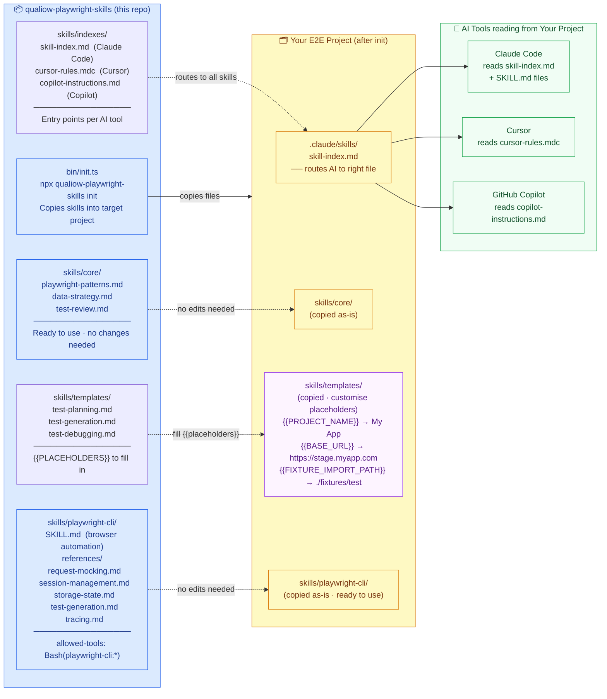
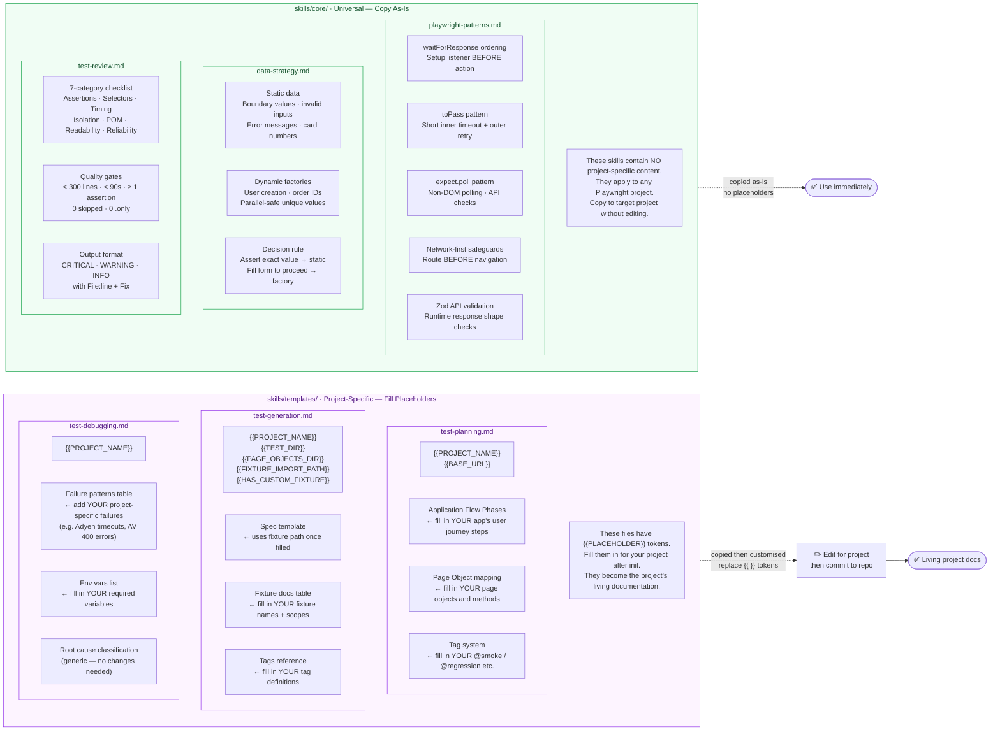

# qualiow-playwright-skills — Skill Diagrams

Five focused diagrams covering the package architecture, the decision tree, the playwright-cli skill, the core vs template skill layers, and the playwright-cli command map.

---

## Diagram 1 · Package Architecture — How It Installs into a Project

This is a distributable library. The `init` CLI copies skills into the consuming project, which then customises the templates.



---

## Diagram 2 · Decision Tree — Skill Index & Entry Points

How the AI is routed from user intent through the index to the right skill file.

```mermaid
flowchart TB
    subgraph ENTRY ["Entry Points  ·  skills/indexes/"]
        direction LR
        IDX_C["skill-index.md\nClaude Code / generic\nDecision tree + skill table"]
        IDX_CUR["cursor-rules.mdc\nCursor IDE\nGlob: **/*.spec.ts · **/*.page.ts\nKey rules summary inline"]
        IDX_COP["copilot-instructions.md\nGitHub Copilot\nSame content as skill-index\nbut Copilot-compatible format"]
    end

    Intent{What does\nthe engineer\nneed?}

    IDX_C & IDX_CUR & IDX_COP --> Intent

    Intent -->|"Write NEW test"| W["📝 New Test Path\n(3 skills in sequence)"]
    Intent -->|"Debug FAILING test"| D["🔍 Debugging Path\n(1 skill)"]
    Intent -->|"Understand PATTERNS"| P["📐 Patterns Path\n(3 skills)"]
    Intent -->|"Follow CONVENTIONS"| CV["📋 Conventions Path\n(1 skill — template)"]
    Intent -->|"Use PLAYWRIGHT CLI"| CLI["🖥️ Browser Automation\n(1 structured skill)"]

    subgraph NEW ["Writing a New Test"]
        direction LR
        TP["test-planning.md\nExplore with CLI\nTest plan template\nPlanning checklist"]
        TG["test-generation.md\nSpec scaffold template\nPOM class structure\nFixture docs"]
        TR["test-review.md\n7-category checklist\nQuality gates\nCRITICAL / WARNING / INFO"]
        TP --> TG --> TR
    end

{{#if HAS_PLAYWRIGHT_159}}
    subgraph DBG ["Debugging"]
        TD["test-debugging.md\nFailure patterns table\nRoot cause classification\nApp bug vs test bug tree\n─────────────────\nAgent workflow (v1.59+):\n--debug=cli · trace analysis\nbrowser.bind()"]
    end
{{/if}}
{{#if NO_PLAYWRIGHT_159}}
    subgraph DBG ["Debugging"]
        TD["test-debugging.md\nFailure patterns table\nRoot cause classification\nApp bug vs test bug tree"]
    end
{{/if}}

    subgraph PAT ["Patterns"]
        direction LR
        PP["playwright-patterns.md\nwaitForResponse ordering\ntoPass · expect.poll\nNetwork-first safeguards\nZod validation"]
        DS["data-strategy.md\nStatic vs dynamic\nDecision criteria\nFactory template"]
        POM_NOTE["page-object-conventions.md\n(in template: test-generation.md)\nSelector priority\nComponent composition"]
    end

    subgraph CONV ["Conventions"]
        PC["project-conventions.md\n(template placeholder)\nMUST · SHOULD · WON'T\nFile organisation · CI/CD"]
    end

    subgraph CLIK ["playwright-cli Skill"]
        CLISK["playwright-cli/SKILL.md\nFull command reference\nallowed-tools: Bash(playwright-cli:*)\nLinks to 5 sub-references"]
    end

    W --> NEW
    D --> DBG
    P --> PAT
    CV --> CONV
    CLI --> CLIK

    classDef entry fill:#dbeafe,stroke:#2563eb,color:#1e3a8a
    classDef path  fill:#fef9c3,stroke:#d97706,color:#78350f
    classDef skill fill:#f0fdf4,stroke:#16a34a,color:#14532d

    class ENTRY,IDX_C,IDX_CUR,IDX_COP entry
    class W,D,P,CV,CLI path
    class TP,TG,TR,TD,PP,DS,POM_NOTE,PC,CLISK skill
```

---

## Diagram 3 · playwright-cli Skill — Structured Browser Automation

How the playwright-cli skill is organised and what each reference covers.

```mermaid
flowchart TB
    subgraph MAIN ["playwright-cli/SKILL.md  ·  Main Skill Entry Point"]
        direction TB
        M1["Metadata\nallowed-tools: Bash(playwright-cli:*)\nGrants Claude Code permission\nto run playwright-cli commands"]
        M2["Quick start workflow\nopen → goto → interact → snapshot → close"]
        M3["Core command reference\nNavigation · Inspection · Interaction\nKeyboard · Mouse · Storage\nNetwork · DevTools · Tabs"]
        M4["Open parameters\n--browser · --persistent\n--profile · --config · --extension"]
        M5["Session management\n-s=name flag · list · close-all · kill-all"]
        M6["Links to sub-references\nfor specialised tasks"]
        M1 --> M2 --> M3 --> M4 --> M5 --> M6
    end

    subgraph REFS ["playwright-cli/references/  ·  Sub-References"]
        direction LR

        subgraph R1 ["request-mocking.md"]
            RM1["CLI route commands\nroute · unroute · route-list"]
            RM2["URL patterns\n** wildcards · extensions\nquery params"]
            RM3["Advanced: run-code\nConditional responses\nModify real responses\nSimulate failures\nDelayed responses"]
        end

        subgraph R2 ["session-management.md"]
            SM1["-s=name flag\nIsolated cookies + storage\nper named session"]
            SM2["Session lifecycle\nopen · close · close-all\nkill-all · delete-data"]
            SM3["Patterns\nConcurrent scraping\nA/B testing\nPersistent profiles"]
        end

        subgraph R3 ["storage-state.md"]
            SS1["state-save / state-load\nFull browser state\n(cookies + localStorage)"]
            SS2["Cookie management\ncookie-list · get · set\ndelete · clear"]
            SS3["localStorage + sessionStorage\nlist · get · set · delete · clear"]
        end

        subgraph R4 ["test-generation.md"]
            TG1["Every CLI action\nauto-generates Playwright\nTypeScript code"]
            TG2["Collect generated code\ninto a test file\nAdd assertions manually"]
        end

{{#if HAS_PLAYWRIGHT_159}}
        subgraph R5 ["tracing.md"]
            TR1["tracing-start / tracing-stop\nCaptures: DOM · screenshots\nnetwork · console · timing"]
            TR2["CLI Trace Analysis (v1.59+)\ntrace open · trace actions\ntrace snapshot · trace requests\ntrace errors"]
            TR3["--debug=cli\nbrowser.bind()\nAgent debugging workflow"]
        end
{{/if}}
{{#if NO_PLAYWRIGHT_159}}
        subgraph R5 ["tracing.md"]
            TR1["tracing-start / tracing-stop\nCaptures: DOM · screenshots\nnetwork · console · timing"]
            TR2["Output: .trace file\n+ .network log\n+ resources/"]
            TR3["Trace vs Video vs Screenshot\ncomparison table"]
        end
{{/if}}
    end

    M6 --> R1 & R2 & R3 & R4 & R5

{{#if HAS_PLAYWRIGHT_159}}
    subgraph WORKFLOW ["Agent Debug Workflow (v1.59+)"]
        direction LR
        W1["CI test fails\ntrace artifact produced"]
        W2["npx playwright trace open\n<trace.zip>"]
        W3["trace actions --grep='expect'\nfind failing assertion"]
        W4["trace snapshot <step>\ninspect page state"]
        W5["trace requests --failed\ncheck API errors"]
        W6["Fix test or report bug\nverify with --debug=cli"]
        W1 --> W2 --> W3 --> W4 --> W5 --> W6
    end
{{/if}}
{{#if NO_PLAYWRIGHT_159}}
    subgraph WORKFLOW ["Typical Debug Workflow"]
        direction LR
        W1["playwright-cli open {url}"]
        W2["playwright-cli snapshot"]
        W3["playwright-cli tracing-start"]
        W4["playwright-cli click / fill / ..."]
        W5["playwright-cli snapshot\nverify state"]
        W6["playwright-cli tracing-stop\nopen trace.playwright.dev"]
        W1 --> W2 --> W3 --> W4 --> W5 --> W6
    end
{{/if}}

    MAIN --> WORKFLOW

    classDef main fill:#dbeafe,stroke:#2563eb,color:#1e3a8a
    classDef ref  fill:#fef9c3,stroke:#d97706,color:#78350f
    classDef wf   fill:#f0fdf4,stroke:#16a34a,color:#14532d

    class MAIN,M1,M2,M3,M4,M5,M6 main
    class REFS,R1,R2,R3,R4,R5 ref
    class WORKFLOW,W1,W2,W3,W4,W5,W6 wf
```

---

## Diagram 4 · Core vs Templates — Two Skill Layers

The distinction between ready-to-use core skills and template skills that require project-specific customisation.



---

## Diagram 5 · playwright-cli Command Map

All command groups and what they do.

```mermaid
flowchart TB
    CLI["playwright-cli"]

    subgraph NAV ["Navigation"]
        direction LR
        N1["open {url}\ngoto {url}\nback · forward · reload"]
    end

    subgraph INSPECT ["Inspection"]
        direction LR
        I1["snapshot\nsnapshot --selector css\nsnapshot --filename=file.yaml"]
        I2["screenshot\nscreenshot e5\npdf --filename=page.pdf"]
        I3["eval 'expression'\neval 'fn' e5"]
    end

    subgraph INTERACT ["Interaction"]
        direction LR
        A1["click e3\ndblclick e7\nhover e4"]
        A2["fill e5 'value'\ntype 'text'\nselect e9 'option'"]
        A3["check e12\nuncheck e12\ndrag e2 e8\nupload ./file.pdf"]
        A4["dialog-accept\ndialog-accept 'text'\ndialog-dismiss"]
        A5["resize 1920 1080"]
    end

    subgraph KEYS ["Keyboard / Mouse"]
        direction LR
        K1["press Enter\npress ArrowDown\nkeydown Shift · keyup Shift"]
        K2["mousemove x y\nmousedown · mouseup\nmousewheel 0 100"]
    end

    subgraph STORAGE ["Storage"]
        direction LR
        S1["state-save {file}\nstate-load {file}"]
        S2["cookie-list · cookie-get\ncookie-set · cookie-delete\ncookie-clear"]
        S3["localstorage-list/get/set\nlocalstorage-delete/clear"]
        S4["sessionstorage-list/get/set\nsessionstorage-delete/clear"]
    end

    subgraph NETWORK ["Network"]
        direction LR
        NW1["route 'pattern' --status=404\nroute 'pattern' --body='{}'\nroute-list · unroute"]
    end

    subgraph TABS ["Tabs"]
        direction LR
        T1["tab-new {url}\ntab-list\ntab-select N\ntab-close N"]
    end

    subgraph DEVTOOLS ["DevTools"]
        direction LR
        DT1["console · console warning\nnetwork"]
        DT2["tracing-start · tracing-stop\nvideo-start · video-stop {file}"]
        DT3["run-code 'async page => ...'"]
    end

{{#if HAS_PLAYWRIGHT_159}}
    subgraph AGENT_DEBUG ["Agent Debug (v1.59+)"]
        direction LR
        AD1["npx playwright test --debug=cli\nStep through from terminal"]
        AD2["npx playwright trace open\ntrace actions · trace snapshot\ntrace requests · trace errors"]
        AD3["browser.bind()\nExpose browser to CLI/MCP"]
    end
{{/if}}

    subgraph SESSIONS ["Sessions"]
        direction LR
        SE1["-s=name  flag on any command\nlist · close-all · kill-all\ndelete-data"]
    end

    subgraph OPEN_FLAGS ["Open Flags"]
        direction LR
        OF1["--browser=chrome/firefox/webkit/msedge\n--persistent · --profile=/path\n--config=file.json · --extension\n--headed"]
    end

    CLI --> NAV & INSPECT & INTERACT & KEYS
    CLI --> STORAGE & NETWORK & TABS & DEVTOOLS
{{#if HAS_PLAYWRIGHT_159}}    CLI --> SESSIONS & OPEN_FLAGS & AGENT_DEBUG{{/if}}
{{#if NO_PLAYWRIGHT_159}}    CLI --> SESSIONS & OPEN_FLAGS{{/if}}

    classDef grp fill:#dbeafe,stroke:#2563eb,color:#1e3a8a
{{#if HAS_PLAYWRIGHT_159}}    class NAV,INSPECT,INTERACT,KEYS,STORAGE,NETWORK,TABS,DEVTOOLS,SESSIONS,OPEN_FLAGS,AGENT_DEBUG grp{{/if}}
{{#if NO_PLAYWRIGHT_159}}    class NAV,INSPECT,INTERACT,KEYS,STORAGE,NETWORK,TABS,DEVTOOLS,SESSIONS,OPEN_FLAGS grp{{/if}}
```

---

## Skill Reference Summary

| File | Layer | Type | What it covers |
|---|---|---|---|
| `skills/indexes/skill-index.md` | Entry point | Claude Code | Decision tree routing all intents to skill files |
| `skills/indexes/cursor-rules.mdc` | Entry point | Cursor | Same rules in `.mdc` format with glob patterns |
| `skills/indexes/copilot-instructions.md` | Entry point | GitHub Copilot | Same rules in Copilot-compatible format |
| `skills/core/playwright-patterns.md` | Core | Universal | `waitForResponse`, `toPass`, `expect.poll`, network-first, Zod |
| `skills/core/data-strategy.md` | Core | Universal | Static vs dynamic data decision criteria + factory template |
| `skills/core/test-review.md` | Core | Universal | 7-category checklist, quality gates, CRITICAL/WARNING/INFO format |
| `skills/templates/test-planning.md` | Template | Project-specific | Exploration workflow, flow phases `{{placeholder}}`, plan template |
| `skills/templates/test-generation.md` | Template | Project-specific | Spec scaffold, POM structure, fixture docs `{{placeholder}}` |
| `skills/templates/test-debugging.md` | Template | Project-specific | Failure patterns, root cause classification, env vars `{{placeholder}}` |
| `skills/playwright-cli/SKILL.md` | Skill | Universal | Full `playwright-cli` command reference, `allowed-tools` declaration |
| `skills/playwright-cli/references/request-mocking.md` | Sub-reference | Universal | Route mocking, conditional responses, network failures |
| `skills/playwright-cli/references/session-management.md` | Sub-reference | Universal | Named sessions, isolation, lifecycle, persistent profiles |
| `skills/playwright-cli/references/storage-state.md` | Sub-reference | Universal | state-save/load, cookies, localStorage, sessionStorage |
| `skills/playwright-cli/references/test-generation.md` | Sub-reference | Universal | Auto-generated code from CLI actions → test files |
{{#if HAS_PLAYWRIGHT_159}}| `skills/playwright-cli/references/tracing.md` | Sub-reference | Universal | tracing-start/stop, CLI trace analysis (v1.59+), --debug=cli, browser.bind(), agent debugging workflow |{{/if}}
{{#if NO_PLAYWRIGHT_159}}| `skills/playwright-cli/references/tracing.md` | Sub-reference | Universal | tracing-start/stop, output files, trace vs video vs screenshot |{{/if}}

## Key Design Points

- **Two-layer skill system:** `core/` is copy-paste ready; `templates/` has `{{PLACEHOLDERS}}` that become living project documentation once filled in.
- **Three AI tool formats:** The same knowledge ships as `skill-index.md` (Claude), `cursor-rules.mdc` (Cursor), and `copilot-instructions.md` (Copilot) — one source, three consumers.
- **`allowed-tools` declaration:** The `playwright-cli/SKILL.md` front-matter `allowed-tools: Bash(playwright-cli:*)` grants Claude Code direct permission to run browser automation commands without prompting.
- **Code generation built-in:** Every `playwright-cli` interaction outputs the equivalent Playwright TypeScript code, bridging exploration and test authoring.
